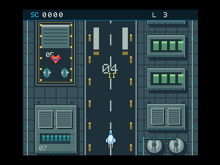
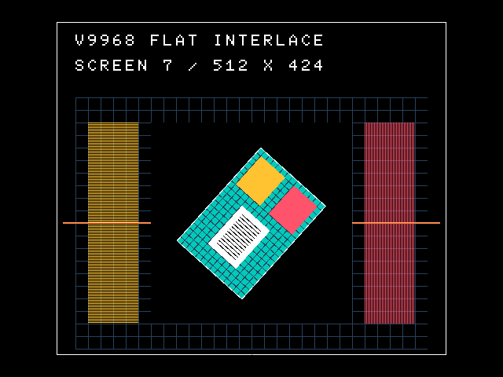

# V9968 拡張BASIC

**V9968版openMSX** 上で、MSX BASICからV9968の拡張機能を使うための **16KB拡張ROM** です。
標準のBASIC ROMを書き換えず、`CALL`（省略形 `_`）で回転・拡大縮小COPY、拡張パレット、スプライトモード3などを利用できます。

開発中のプロジェクトです。実機での動作は未検証で、外付けV9968カートリッジにも未対応です。

  
  

*BASIC製シューティングと、フラットインターレースのデモ。V9968版openMSXでの表示です。*

## 主な機能

- **回転・拡大縮小・透明COPY**：角度と倍率をBASICの数式で指定。全10種類の論理演算、数値配列との画像転送にも対応。
- **拡張グラフィック**：SCREEN 5～8での描画、256KB VRAMへのページ指定、フラットインターレース。SCREEN 6・7では512×424表示。
- **拡張パレット**：RGB各32段階。SCREEN 8では32,768色から選ぶ256色。
- **スプライトモード3**：最大64枚、1ライン最大16枚。拡大縮小・反転・背景との半透明合成。
- **従来スプライトの拡張**：水平16枚表示、優先順位シャッフル、背景の縦スクロールからの位置切り離し。
- **フォントと素材作成**：8×8フォントを従来の `GRP:` 出力で使用。表示モードに依存しない4bppの素材描画。

標準BASICの変数・配列・式評価・ファイル操作と組み合わせて使えます。BASIC全体の画面・ページ制限を置き換えるものではなく、拡張機能には専用命令を使用します。

## デモ

回転COPY、半透明スプライト、32枚のスプライト波形、SCREEN 8のパレット、フォント、論理COPY、円・楕円、シューティングなどのBASICデモを収録しています。

環境を準備した後は、`run.bat` でビルドからデモメニューの起動まで行えます。各デモからは **Esc** でメニューへ戻れます。
デモはROMに埋め込まず仮想フロッピーから読み込むため、[BASICソース](demo/)を編集して試すことができます。

## 動作環境

付属のビルド・起動スクリプトはWindows向けです。

| 用途 | 検証対象・必要なもの |
|---|---|
| スクリプト | PowerShell 7、Node.js 22以降 |
| ビルド | z88dkの `z88dk-z80asm.exe` |
| エミュレータ | openMSX 21.0のデータと、buppu3氏のV9968版Windowsバイナリ **`d884c4b`** |
| 機種 | V9968構成のFS-A1ST（R800）、最小MSX2+構成（Z80） |
| システムROM | 利用者自身で用意したMSXのBIOS・機種用ROM |

通常のV9958構成では動作しません。V9968版openMSXもビルドによって仕様が異なるため、最新版との互換性は保証していません。
エミュレータ本体・MSXのシステムROMは、このリポジトリに含みません。

## 対応範囲と制限

| 機能 | 現在の対応 |
|---|---|
| 拡張描画・COPY・ページ指定 | SCREEN 5・6・7・8、通常表示／フラットインターレース |
| スプライトモード3 | 非FILのSCREEN 1～6 |
| 拡張フォント | 非FILのSCREEN 5、8×8ドット |
| パターン素材描画 | 表示モードとは別にSCREEN 5形式の4bpp画像を作成 |

- SCREEN 10～12のYJK描画、8×16フォント・漢字、割り込みイベント用BASIC命令は未実装です。
- スプライトモード3のSCREEN 7以降は、検証対象forkのVRAM配列切替の問題により無効にしています。
- 検証対象forkには、上位VRAMページの直接表示、SCREEN 6のモード3スプライトのX=256以降、SCREEN 8のFIL表示の右端に制限があります。
- スプライトの半透明は背景との合成です。別のスプライトは透けません。
- 他の常駐ROMやMSX-DOSとの共存、メモリ不足時を含む網羅的な安全性検証は完了していません。

## ドキュメント

- **[導入・ビルド・デモの起動](docs/getting-started.md)**：環境の準備、起動方法、デモの選び方。
- **[命令リファレンス](docs/commands.md)**：実装済み命令の書式、引数、使用例、注意点。
- **[BASICデモ](demo/)**：プログラムからの利用例。

## 資料・謝辞

V9968の仕様解説とエミュレータを公開されている方々に感謝します。

- [HRA!氏によるV9968の機能解説](https://note.com/thara1129/n/n7f9f293e6066)
- [buppu3氏のV9968版openMSX](https://buppu3.github.io/)
- [V9968プログラマーズマニュアル英訳の案内](https://www.msx.org/forum/msx-talk/hardware/v9968-programmers-manual-translated-to-english)

## ライセンス

本プロジェクトは **MIT License** です。[LICENSE](LICENSE)を参照してください。
外部のエミュレータ、システムROM、参照資料には、それぞれの利用条件が適用されます。
